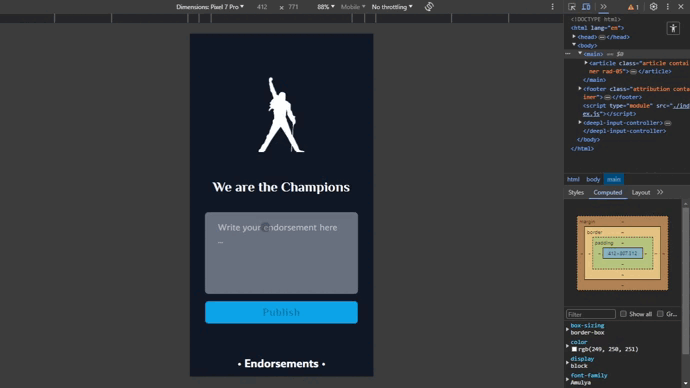
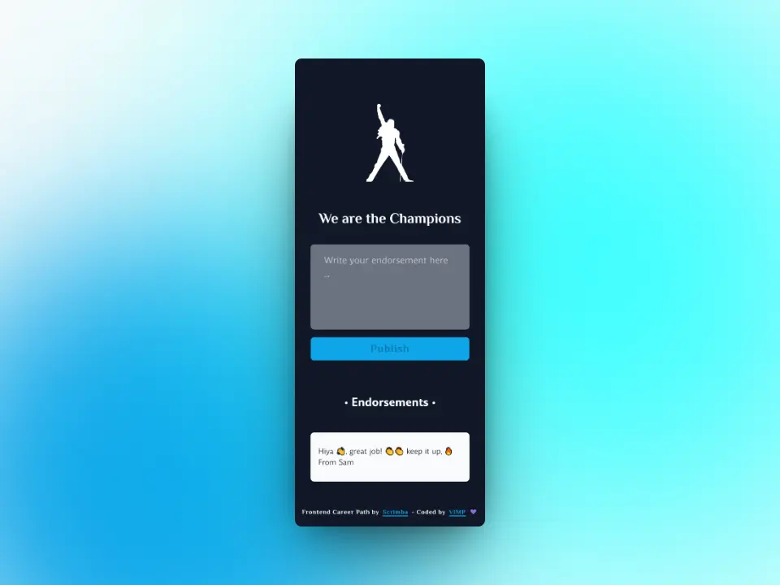
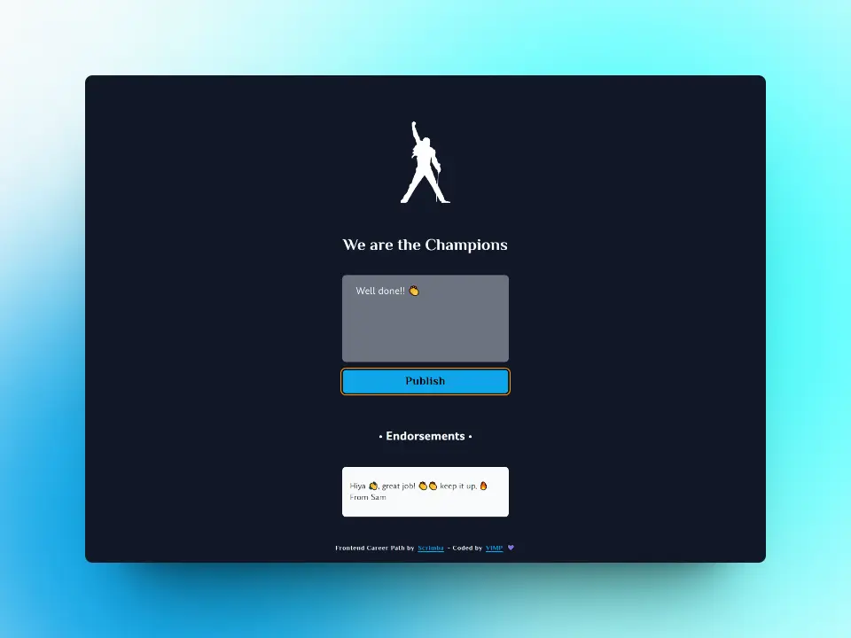

# Password Generator - Solo Project

This is my solution to the Solo project: Password Generator of the course [**Frontend Career Path**](https://scrimba.com/learn/frontend) by [**Scrimba**](https://scrimba.com/).

### Table Contents

+ [The challenges](#the-challenges)
+ [Screenshots](#screenshots)
+ [Links](#links)
+ [Built with](#built-with)
+ [Useful resources](#useful-resources)
+ [Author](#author)

## ***The challenges***
🎯 Build it from "scratch"

🎯 Follow the design

🎯 Firebase realtime database

🎯 Update in realtime

## ***Screenshots***
### 📱 Mobile

### 💻 Desktop

## ***Links***

[Live site](https://mendez-v.github.io/champions/) 👀

[Scrim](https://scrimba.com/scrim/cEN2MRfN) 👀

[All my FCP projects](https://github.com/mendez-v/frontend-career-path) 👀

## ***Built with***

✅ Mobile-first workflow

✅ Semantic HTML markup

✅ Custom properties

✅ Utility classes

✅ Flexbox

✅ CSS Grid

## ***Useful resources***
🌈 Favicon - <a href="https://iconscout.com/3d-illustrations/first-place-medal" class="text-underline font-size-sm" target="_blank">First Place Medal</a> by <a href="https://iconscout.com/contributors/thehalaldesign" class="text-underline font-size-sm">The Halal Design Studio</a> on <a href="https://iconscout.com" class="text-underline font-size-sm">IconScout</a>

## ***Author***

✨ Frontend Mentor - [@mendez-v](https://www.frontendmentor.io/profile/mendez-v)